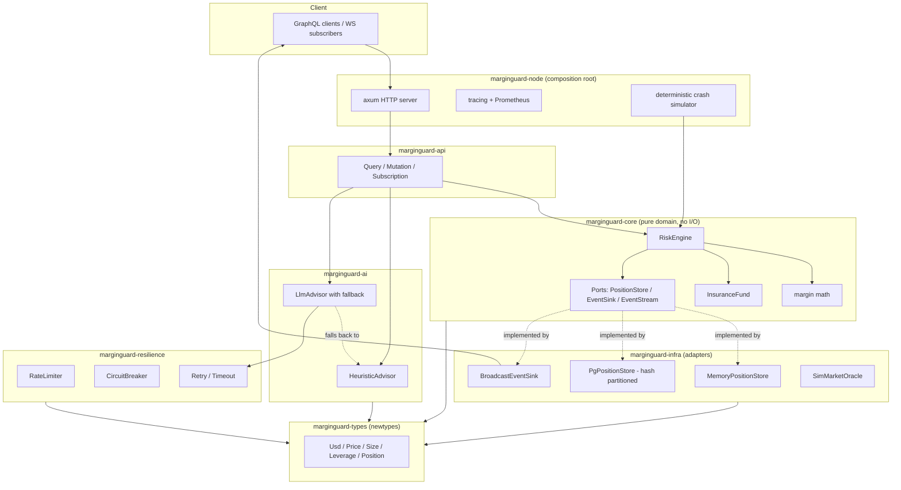
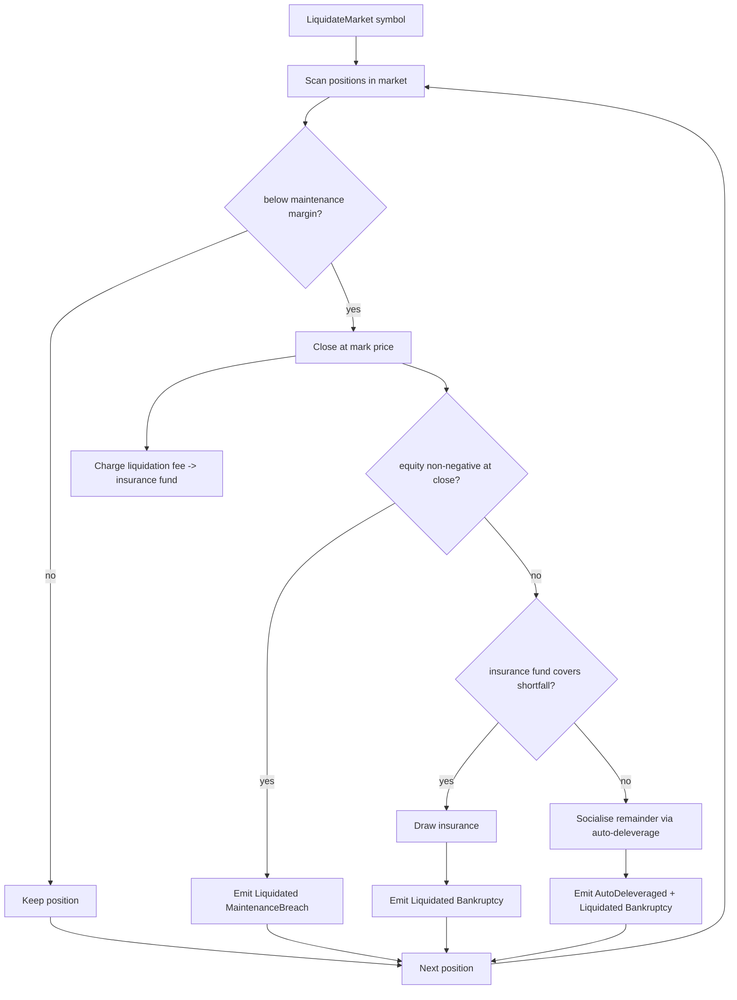
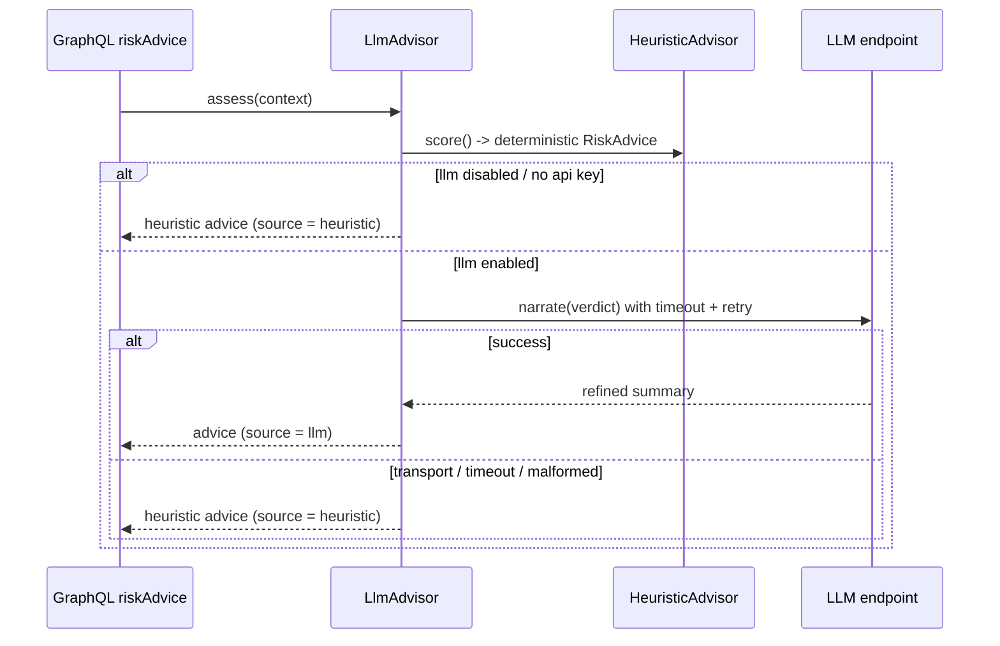

# MarginGuard

> A perpetual-futures **margin, funding, liquidation & risk engine** in Rust —
> cross/isolated margin, a mark-price oracle, funding accrual, a full
> **liquidation waterfall** with an insurance fund and **auto-deleveraging**,
> property-tested solvency invariants, and a **GenAI risk advisor** that
> degrades gracefully to a deterministic heuristic.

MarginGuard is the risk core a perps DEX runs behind its matching engine. It
takes a stream of risk **commands** (open/close positions, mark-price updates,
funding ticks, liquidation sweeps), maintains every account's health on a
fixed-point ledger, and emits an ordered stream of **events** (positions opened,
funding settled, liquidations, ADL) that settlement, accounting, and alerting
systems consume.

[](https://github.com/ABHIJEET-MUNESHWAR/MarginGuard/actions/workflows/ci.yml)
[](https://github.com/ABHIJEET-MUNESHWAR/MarginGuard/stargazers)
[](https://github.com/ABHIJEET-MUNESHWAR/MarginGuard/issues)
[](https://github.com/ABHIJEET-MUNESHWAR/MarginGuard/commits/main)
[](https://github.com/ABHIJEET-MUNESHWAR/MarginGuard)
[](rust-toolchain.toml)

---

## Table of Contents

1. [Highlights](#highlights)
2. [Architecture](#architecture)
3. [Crate Layout](#crate-layout)
4. [The Liquidation Waterfall](#the-liquidation-waterfall)
5. [Margin Model](#margin-model)
6. [GenAI Risk Advisor](#genai-risk-advisor)
7. [Complexity & Performance](#complexity--performance)
8. [GraphQL API](#graphql-api)
9. [Running It](#running-it)
10. [Configuration](#configuration)
11. [Observability](#observability)
12. [Persistence & Partitioning](#persistence--partitioning)
13. [Testing](#testing)
14. [Benchmarks](#benchmarks)
15. [Project Standards Map](#project-standards-map)

---

## Highlights

- **Fixed-point money everywhere.** All value is signed `i128` micro-USD
  (`SCALE = 1_000_000`); the engine never touches `f64` for money, so there are
  no rounding-drift surprises in PnL, margin, or funding.
- **Cross & isolated margin** with a standard tiered risk model (initial /
  maintenance / liquidation-fee in basis points), mark-vs-index pricing, and a
  per-account health check (`equity`, `notional`, `maintenance margin`,
  `margin ratio`, `liquidatable`).
- **Full liquidation waterfall.** Underwater positions are closed at the mark;
  the close fee feeds an **insurance fund**; bankruptcy losses draw the fund
  first and only then **socialise** via auto-deleveraging (ADL) — never silently
  insolvent.
- **Funding that is provably zero-sum.** A property test asserts that a funding
  tick transfers value between longs and shorts and nets to zero.
- **Solvency invariants in proptest.** Randomised scenarios assert that after a
  liquidation sweep *no* underwater position survives.
- **GenAI risk advisor with graceful fallback.** A deterministic heuristic
  always produces an answer; the optional LLM backend (behind the `llm` feature)
  only *narrates* that verdict and **falls back to the heuristic on any error,
  timeout, or missing key** — the API never fails because the model is down.
- **CQRS + event sourcing.** The write side (`RiskCommand`) is isolated from the
  read side (`RiskEvent`), which is broadcast to GraphQL subscribers.
- **Hexagonal.** A pure domain crate with zero I/O dependencies, surrounded by
  swappable adapters (in-memory store, Postgres store, broadcast bus, simulated
  oracle) and an `async-graphql` API.

---

## Architecture



Dependencies point **inward**: `types` → `resilience` → `core` → `ai` →
`infra` → `api` → `node`. The domain crate (`core`) depends on nothing web- or
storage-specific; adapters implement its ports.

---

## Crate Layout

| Crate | Responsibility | Key types |
|---|---|---|
| `marginguard-types` | Compile-time-safe domain vocabulary (newtypes). No logic. | `Usd`, `Price`, `Size`, `Leverage`, `Symbol`, `Position`, `Side`, `MarginMode` |
| `marginguard-resilience` | Reusable fault-tolerance primitives over an injectable `Clock`. | `RateLimiter`, `CircuitBreaker`, `RetryPolicy`, `with_timeout` |
| `marginguard-core` | The risk engine — margin math, funding, liquidation waterfall, insurance, ADL. Pure & deterministic. | `RiskEngine`, `RiskCommand`, `RiskEvent`, `InsuranceFund`, `margin::*` |
| `marginguard-ai` | Risk advisory: deterministic heuristic + optional LLM narrator with fallback. | `RiskAdvisor`, `HeuristicAdvisor`, `LlmAdvisor`, `RiskAdvice` |
| `marginguard-infra` | Adapters implementing core ports: in-memory & Postgres stores, broadcast bus, oracle. | `MemoryPositionStore`, `PgPositionStore`, `BroadcastEventSink`, `SimMarketOracle` |
| `marginguard-api` | `async-graphql` schema — anti-corruption layer over the domain. | `build_schema`, `QueryRoot`, `MutationRoot`, `SubscriptionRoot` |
| `marginguard-node` | Composition root: CLI, axum server, telemetry, crash simulator, benches. | `run`, `build_server`, `run_simulation` |

---

## The Liquidation Waterfall

When a market is swept, every position is checked against its maintenance
margin. Each underwater position flows through the waterfall below; the order
is deterministic so the emitted event stream is canonical.



- **Maintenance breach** — the common case: the position still has positive
  equity at the mark, so closing it plus a fee leaves the system whole and tops
  up the insurance fund.
- **Bankruptcy** — a gap move pushed equity negative before the sweep caught it.
  The shortfall is paid from the insurance fund first.
- **Auto-deleverage (ADL)** — only if the insurance fund is exhausted is the
  residual loss socialised. This is the last line of defence and is explicitly
  event-sourced (`AutoDeleveraged`) so it is auditable.

---

## Margin Model

`notional = size * mark`. For a position with posted margin `m`, entry `e`, and
side sign `s` (+1 long, -1 short):

$$\text{equity} = m + s \cdot (\text{mark} - e) \cdot \text{size} - \text{funding\_paid}$$

$$\text{maintenance} = \text{notional} \cdot \frac{\text{maint\_bps}}{10000}, \qquad
\text{margin ratio} = \frac{\text{equity}}{\text{notional}}$$

A position is **liquidatable** when `equity < maintenance`. The liquidation
price is solved in closed form from that inequality, so the engine can report
"how far from liquidation" without iterating. All arithmetic is integer
micro-USD; basis-point multiplies use `scaled_mul` to avoid overflow and drift.

`RiskParams::standard()` ships sensible defaults (initial 500 bps, maintenance
250 bps, liquidation fee 100 bps) and is swappable per market.

---

## GenAI Risk Advisor

The advisor answers "how risky is this position, and what should the trader do?"
It is built so the **deterministic verdict is always available** and the LLM is a
pure *narration* layer.



- The heuristic classifies risk into `Safe < Caution < Warning < Critical` from
  the margin buffer to liquidation and the funding pressure — deterministic and
  instant.
- The LLM backend (`llm` feature) wraps the heuristic, calls an OpenAI-compatible
  chat endpoint through the resilience `retry` + `with_timeout` helpers, and
  **falls back to the heuristic verdict on any error**. A missing
  `MARGINGUARD_LLM_API_KEY` simply means the heuristic is used. The API contract
  never changes and never fails because of the model.

---

## Complexity & Performance

`n` = positions in the swept market.

| Operation | Time | Why |
|---|---|---|
| `account_health` | `O(1)` | fixed-point arithmetic, no allocation |
| `liquidation_price` | `O(1)` | closed-form solve |
| `funding_payment` | `O(1)` | one bps multiply |
| Liquidation sweep | `O(n)` | single pass over a market's positions |
| `positions_in(symbol)` | `O(n)` | secondary index lookup + collect |

Measured with criterion (release build, `block_on` through the async engine):

| Benchmark | Median |
|---|---|
| `margin/account_health` | **≈ 30 ns** |
| `margin/liquidation_price` | **≈ 487 ps** |
| `liquidation/liquidate_market_10` | **≈ 5.46 µs** |
| `liquidation/liquidate_market_100` | **≈ 51.4 µs** |
| `liquidation/liquidate_market_500` | **≈ 223.8 µs** |

The 10 → 100 → 500 sweep timings scale ~linearly (≈10x then ≈4.4x), confirming
the documented `O(n)` waterfall.

Deterministic crash simulation (24 accounts, 200 steps, −60 bps drift):

```text
┌─ MarginGuard simulation report ────────────────
│ steps              : 200
│ accounts opened    : 24
│ survivors          : 12
│ liquidations       : 12
│ ADL events         : 0
│ funding settlements: 108
│ mark price         : 100.00 -> 31.11 USD
│ insurance fund     : 5000.00 -> 5115.64 USD
└────────────────────────────────────────────────
```

The mark crashed ~69%; all 12 long accounts were liquidated at maintenance while
the 12 shorts survived, and the liquidation fees grew the insurance fund.

---

## GraphQL API

The API is GraphQL (not REST) via `async-graphql` + `axum`, with depth (12) and
complexity (512) limits on every query. **Note:** `openPosition` takes an
`input:` object; the other mutations take flat arguments.

**Queries**

```graphql
query { apiVersion }

query {
  accountHealth(account: "alice", symbol: "SOL-PERP") {
    equity { value }
    notional { value }
    marginRatioBps
    liquidatable
  }
}

query {
  riskAdvice(account: "alice", symbol: "SOL-PERP") {
    riskLevel recommendedAction summary source confidence
  }
}

query { insuranceFund { balance { value } } }
query { riskStats { openPositions liquidations fundingSettlements adlEvents } }
```

**Mutations**

```graphql
mutation {
  updateMarket(symbol: "SOL-PERP", markPrice: 100.0, indexPrice: 100.0, fundingRateBps: 10) {
    liquidationCount
  }
}

mutation {
  openPosition(input: {
    account: "alice", symbol: "SOL-PERP", side: LONG, marginMode: CROSS,
    size: 10.0, entryPrice: 100.0, leverage: 10, margin: 60.0
  }) {
    liquidationCount
    events { kind json }
  }
}

mutation { accrueFunding(symbol: "SOL-PERP") { liquidationCount } }
mutation { liquidateMarket(symbol: "SOL-PERP") { liquidationCount events { kind json } } }
mutation { closePosition(account: "alice", symbol: "SOL-PERP") { liquidationCount } }
```

**Subscriptions** (GraphQL over WebSocket at `/graphql/ws`)

```graphql
subscription { riskEvents { kind json } }
subscription { liquidationAlerts { kind json } }
```

A ready-to-import Postman collection lives in
[`postman/MarginGuard.postman_collection.json`](postman/MarginGuard.postman_collection.json).

---

## Running It

```bash
# Build & test everything
cargo test --workspace

# Run the risk server (GraphQL at http://127.0.0.1:8080/graphql)
cargo run -p marginguard-node -- serve

# Drive a deterministic crash scenario through the engine
#   (note: negative flags use the = form so clap does not read them as options)
cargo run -p marginguard-node -- simulate --accounts 24 --steps 200 --drift-bps=-60
```

With Docker:

```bash
docker compose up --build                  # server only
docker compose --profile monitoring up     # server + Prometheus on :9090
docker compose --profile storage up        # server + Postgres
```

---

## Configuration

| Subcommand | Flag | Env | Default |
|---|---|---|---|
| global | `--log-json` | `MARGINGUARD_LOG_JSON` | `false` |
| `serve` | `--host` | — | `127.0.0.1` |
| `serve` | `--port` | — | `8080` |
| `serve` | `--event-capacity` | — | `4096` |
| `serve` | `--insurance-seed` | — | `1000000` |
| `serve` | `--advisor` | — | `heuristic` (`heuristic` \| `llm`) |
| `simulate` | `--accounts` / `--steps` | — | `20` / `200` |
| `simulate` | `--start-price` / `--drift-bps` / `--vol-bps` | — | `100` / `-50` / `40` |
| `simulate` | `--funding-bps` / `--funding-interval` | — | `10` / `25` |
| `simulate` | `--insurance-seed` / `--seed` | — | `5000` / `42` |

The LLM backend (built with `--features llm`) reads `MARGINGUARD_LLM_API_KEY`,
`MARGINGUARD_LLM_ENDPOINT`, and `MARGINGUARD_LLM_MODEL`; without a key it
transparently uses the heuristic.

---

## Observability

- **Structured tracing** via `tracing` + `tracing-subscriber` (compact or JSON).
- **Prometheus metrics** at `/metrics`:
  `marginguard_positions_opened_total`, `marginguard_positions_closed_total`,
  `marginguard_liquidations_total{reason}`,
  `marginguard_funding_settlements_total`, `marginguard_adl_events_total`,
  and `marginguard_market_updates_total`.
- **Health probes** at `/health/live` and `/health/ready`.

---

## Persistence & Partitioning

The default `MemoryPositionStore` keeps positions in a `parking_lot::RwLock`
with a secondary by-market index. For durability, `PgPositionStore` (feature
`postgres`) persists positions to a Postgres table that is **hash-partitioned by
`symbol`** into four partitions, so a hot market's rows stay isolated and writes
spread across partitions. Money columns are stored as exact `TEXT` micro-USD —
never `f64` or `NUMERIC` round-trips. The DDL lives in
[`migrations/0001_init.sql`](migrations/0001_init.sql) and is also created
idempotently at startup by `ensure_schema`.

---

## Testing

100% of the public surface is covered by unit, integration, and property tests.

| Crate | Tests | What they cover |
|---|---|---|
| `marginguard-types` | 12 | newtype invariants; `Usd` saturating math; positive-bounded `Price`/`Size`; `Leverage` 1..=100 |
| `marginguard-resilience` | 9 | rate-limit token math, breaker transitions, retry backoff, timeout — on a `ManualClock` |
| `marginguard-core` | 16 (incl. 2 proptest) | margin math, funding zero-sum, liquidation waterfall, insurance draw, ADL, port-failure propagation, solvency invariant |
| `marginguard-ai` | 12 | heuristic classification thresholds, advice context math, LLM disabled/unreachable fallback |
| `marginguard-infra` | 6 | store CRUD + by-market index, broadcast fan-out, deterministic oracle, engine-over-adapters crash |
| `marginguard-api` | 6 | version, open+query, AI advice resolver, liquidation via GraphQL, invalid input, live subscription |
| `marginguard-node` | 6 | health/GraphQL/metrics endpoints, GraphiQL, crash simulator produces liquidations |

```bash
cargo test --workspace --all-features
cargo clippy --all-targets --all-features -- -D warnings
cargo fmt --all --check
```

<details>
<summary>Sample <code>cargo test --workspace --all-features</code> output</summary>

```text
test result: ok. 12 passed; 0 failed   (marginguard-types)
test result: ok.  9 passed; 0 failed   (marginguard-resilience)
test result: ok. 16 passed; 0 failed   (marginguard-core)
test result: ok. 12 passed; 0 failed   (marginguard-ai)
test result: ok.  6 passed; 0 failed   (marginguard-infra)
test result: ok.  6 passed; 0 failed   (marginguard-api)
test result: ok.  6 passed; 0 failed   (marginguard-node)
-- 67 passed; 0 failed total --
```

</details>

---

## Benchmarks

```bash
cargo bench -p marginguard-node --bench risk_bench
```

The `margin` group measures the pure health/liquidation-price math; the
`liquidation` group measures the waterfall sweep over 10/100/500 positions. See
[Complexity & Performance](#complexity--performance) for the latest figures.

---

## Project Standards Map

A full self-assessment against the 29 engineering guidelines lives in
[`EVALUATION.md`](EVALUATION.md). In short: SOLID hexagonal design, CQRS +
event sourcing, compile-time-enforced fixed-point money, a property-tested
liquidation/insurance/ADL waterfall, a GenAI advisor with deterministic
fallback, hash-partitioned Postgres persistence, a GraphQL API, full async on
I/O, structured observability, complete test coverage, criterion benchmarks with
documented Big-O, a multi-stage Docker image, and a CI pipeline (fmt + clippy +
test + audit).
